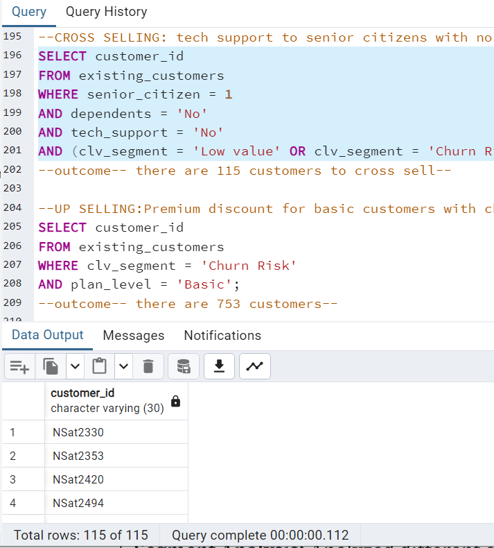
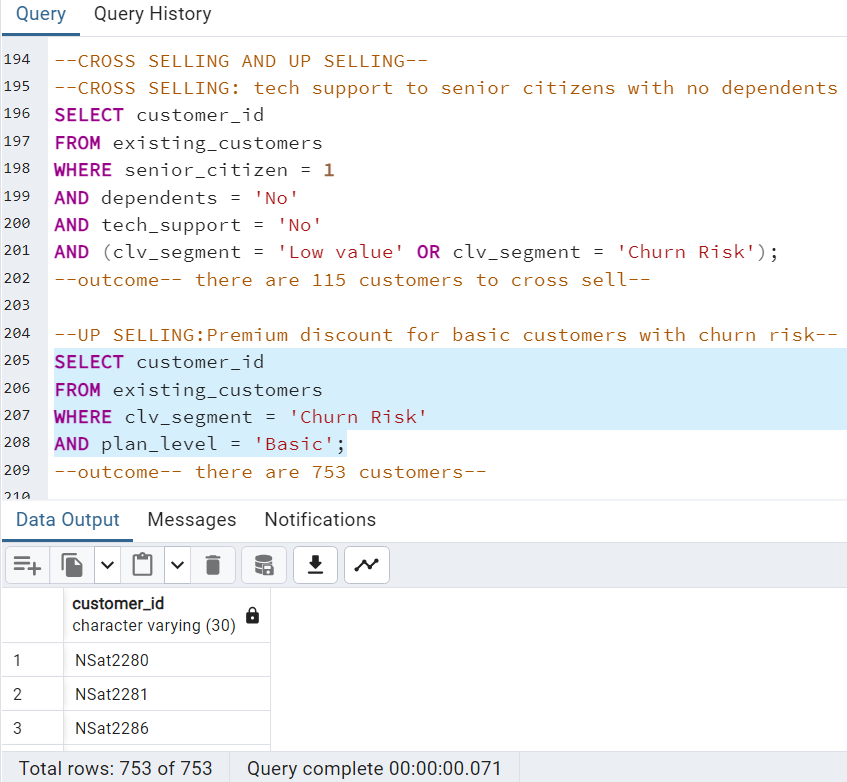

# Telecom Growth Strategies: Unlocking Customer Life Time Value Through Smart Segmentation
## 🏢BUSINESS OVERVIEW 
NexaSat is a leading telecommunications company specializing in mobile internet and television services. It serves diverse customers, ranging from individuals to small and medium-sized businesses. However, NexaSat faces challenges in optimizing marketing strategies and allocating resources efficiently. 
## PROBLEM STATEMENT
Key challenges include:
- Inefficient customer engagement due to a one-size-fits-all approach.
- Lack of a structured approach to leveraging customer data for revenue maximization.
- Need for personalized offers and bundled services to increase Average Revenue Per User (ARPU).
## PROJECT OVERVIEW
This project is all about understanding NexaSat’s customers better and boosting business growth by:
- Grouping customers based on how valuable they are over time (Customer Lifetime Value - CLV).
- Offering personalized services to increase revenue.
- Reducing customer loss by identifying those at risk of leaving and taking action.
## KEY GOALS
- Categorize customers based on their long-term value.
- Find new ways to sell more (cross-selling & up-selling).
- Share clear, practical recommendations to improve NexaSat’s marketing
## TECH STACK
- Database: PostgreSQL
- Data Storage: CSV Files
- Querying & Analysis: SQL

## PROJECT WORKFLOW
### DATA DESCRIPTION:
The dataset contains customer information summarized in this file. [Data Description](DATA_DESCRIPTION.pdf)
### DATA IMPORTATION:
Imported data from a CSV file into PostgreSQL. [NexaSat Dataset](NexaSatData.csv)
- Step 1: Create a schema named "NexaSat"
- Step 2: Create a table "nexa_sat"
- Step 3: Import the CSV data into PostgreSQL

### DATA CLEANING: 
Ensured the data is accurate and reliable by checking for duplicates and null values.
- #### Checking for duplicates

- #### Checking for null values

   

### EXPLORATORY DATA ANALYSIS:
Analyzed customer behavior, service usage trends, and churn rates to derive insights.

### FEATURE ENGINEERING:
Developed relevant features such as CLV and CLV Scores, which serve as key inputs for the CLV segmentation model.
Created CLV and CLV Scores as key segmentation features.

### SEGMENTATION: 
Using CLV scores, customers were segmented into:
- High-Value Customers: Long tenure, high spending.
- Moderate-Value Customers: Medium tenure, moderate spending.
- Churn Risk Customers: Short tenure, irregular spending patterns.

### SEGMENT ANALYSIS:
Analyzed different customer segments to understand their behaviors, characteristics, and potential value to the business over time.

## MARKETING STRATEGIES: 
### CROSS-SELLING AND UP-SELLING:
Employed techniques to maximize sales revenue and improve customer satisfaction by providing more comprehensive solutions or experiences.
#### Cross-Selling Strategies
- Offering tech support to senior citizens without dependents leads to higher satisfaction, increased loyalty, reduced frustration, and enhanced brand image, ultimately resulting in lower churn rates and potential for additional revenue through cross-selling.
  
📌 Target Group: Senior Citizens (No dependents, churn risk).

📌 Offer: Tech Support package.

- Multiple lines for dependents and partners on basic plan
  
#### Up-Selling Strategies
- Offering higher-paying customers cheaper plans with lock-in periods can increase customer retention and lifetime value by reducing churn. This also creates custome loyalty to the brand, not just due to the lock in but because customers appreciate discounts, especially when it appears like the brand is looking out for them.
  
📌 Premium discount for basic users with churn risk

## KEY INSIGHTS AND LEARNINGS
📌 Improved Customer Understanding: Identified high-value and at-risk customers.

📌 Increased Revenue: Significant uplift in ARPU through targeted upselling and cross-selling efforts.

📌 Reduced Churn: Proactive engagement with at-risk customers improved retention.

## FINAL THOUGHTS & CONCLUSION 
Smart segmentation is a game-changer in the telecom industry, offering a strategic pathway to unlock customer lifetime value and drive growth. By leveraging data analytics and personalized strategies, NexaSat can:

✔ Enhance customer experience.

✔ Improve revenue generation.

✔ Strengthen customer loyalty.

## THANK YOU :smile:

