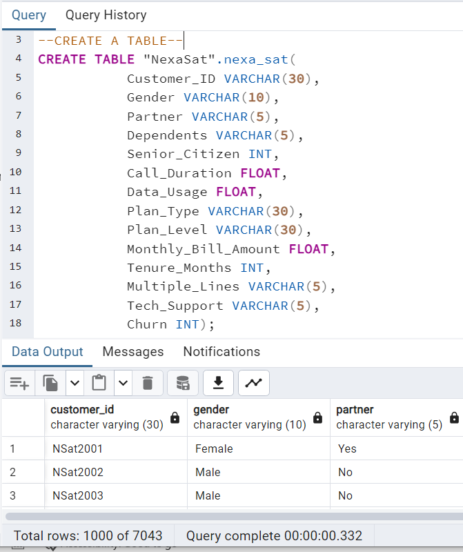
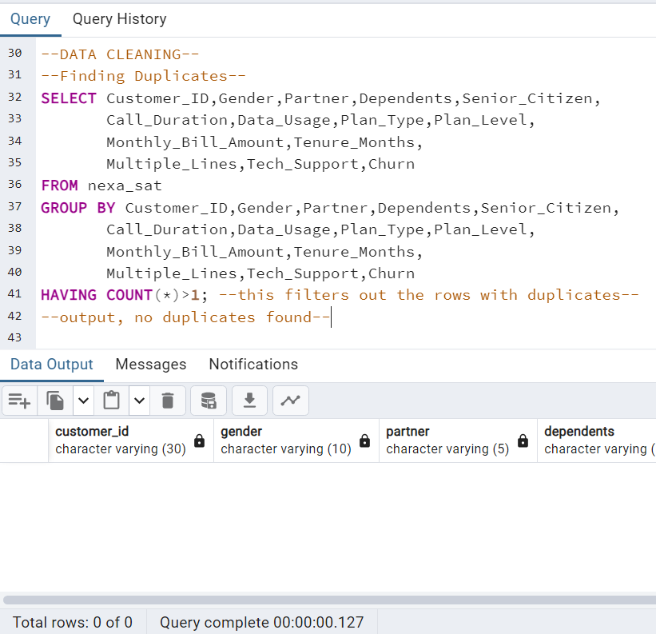
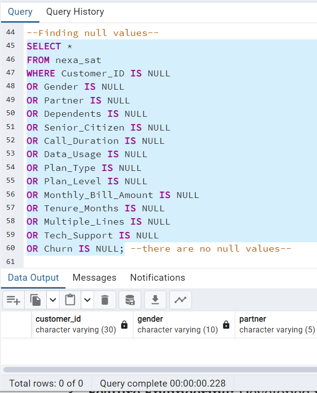
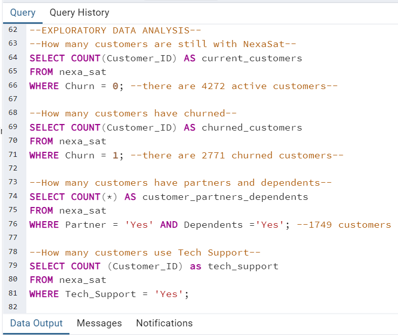
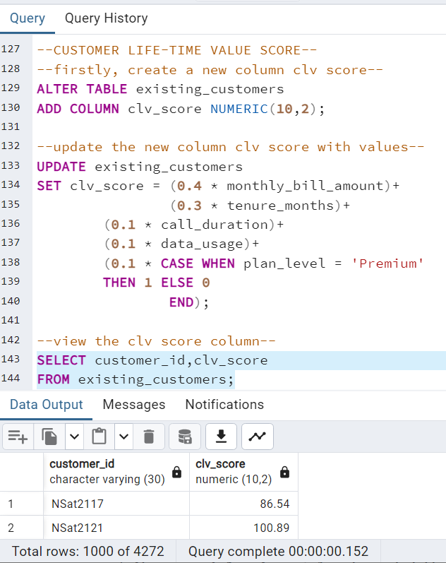
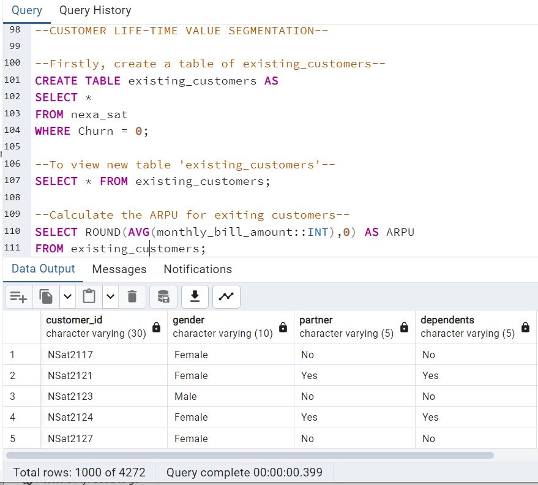
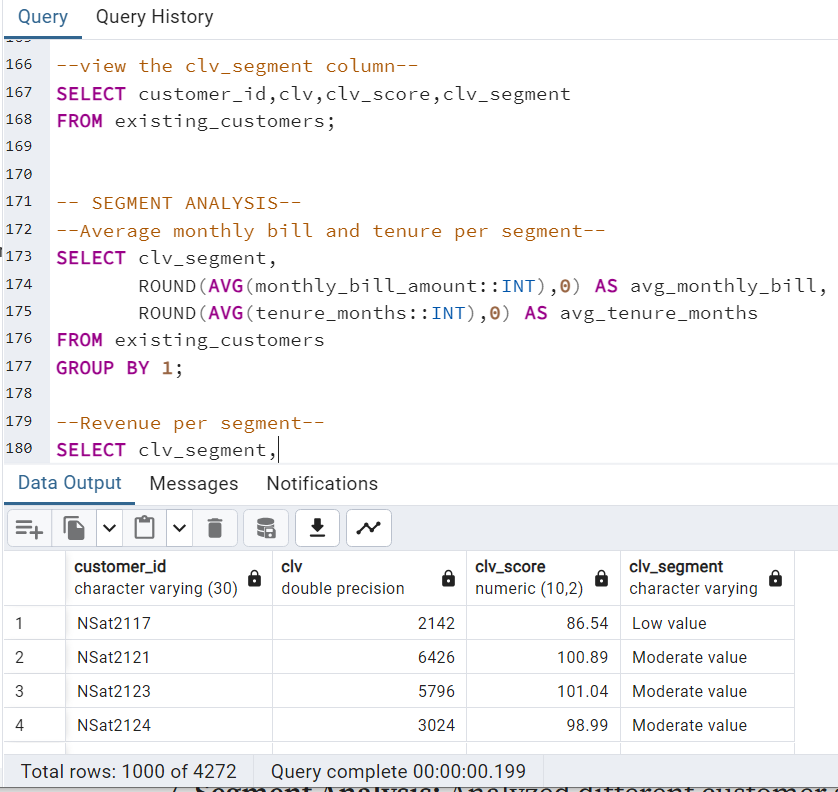
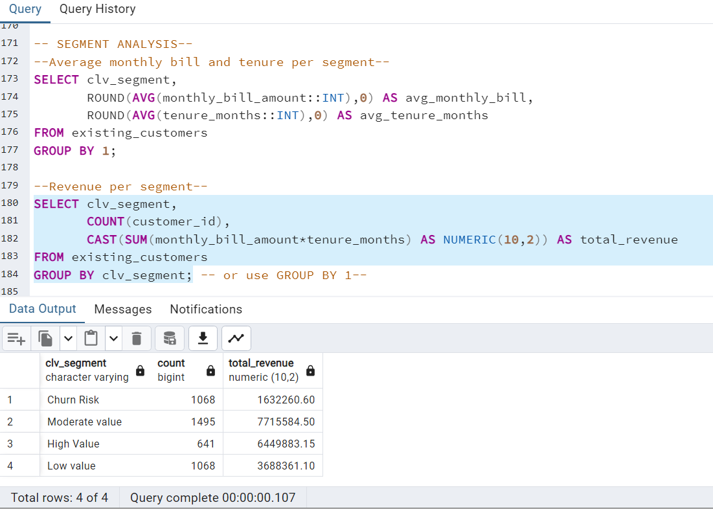
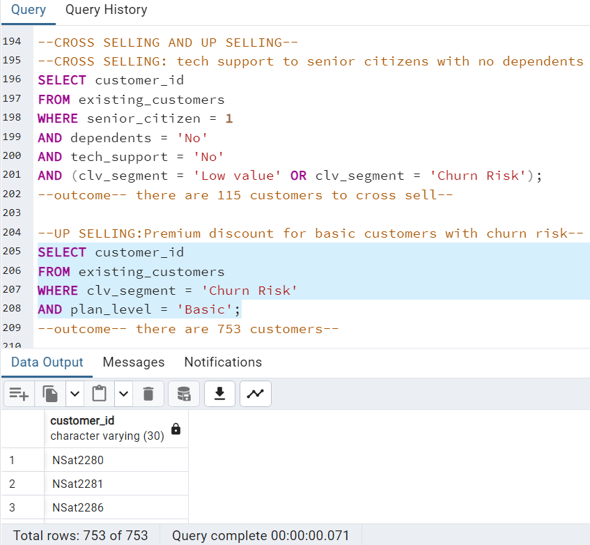
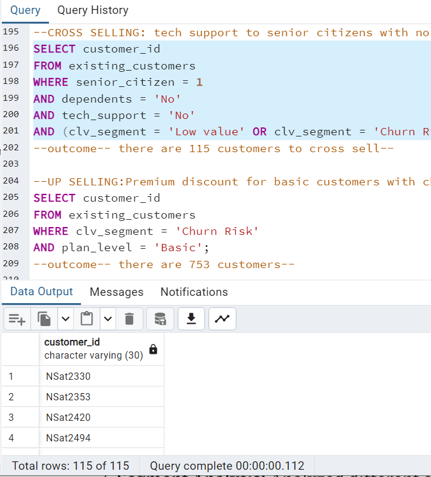

# Telecom-Growth-Strategies-Customer-Life-Time-Value-Segmentation
## INTRODUCTION NexaSat 
A leading telecommunications company specializing in mobile internet and television services, faces challenges in optimizing marketing strategies and allocating resources. In the competitive world of telecommunications, understanding and optimizing Customer Lifetime Value (CLV) is crucial for sustained growth and profitability. One effective strategy to achieve this is through smart segmentation. In this post, I’ll share my experience working on the project focused on unlocking customer lifetime value through smart segmentation, and how it can drive telecom growth strategies.
Check file TELECOM_GROWTH_STRATEGIES.pdf

## PROJECT OVERVIEW 
This project focuses on implementing Customer Lifetime Value (CLV) segmentation at NexaSat in other to;
- Highlighting opportunities for up-selling and cross-selling
- Identify and offer personalized service for high-value segments
- Ensure efficient resource allocation
- Maximize revenue
- Strengthen customer loyalty in a competitive telecom landscape
## APPROACH AND INSIGHTS
1- Data Description: Summarized characteristics of the dataset. Check file DATA_DESCRIPTION.pdf

2- Data Importation: Imported data from a CSV file into PostgreSQL. Check file NexaSatData.csv

3- Data Cleaning: Ensured the data is accurate and reliable by checking for duplicates and null values.

4- Exploratory Data Analysis: Performed an in-depth analysis of the customer dataset, encompassing demographic details and usage trends, yielding valuable insights into customer behavior and preferences.

5- Feature Engineering: Developed relevant features such as CLV and CLV Scores, which serve as key inputs for the CLV segmentation model.

6- Segmentation: Assigned customers to different segments based on their CLV scores, and further segmented users based on demographic data, usage patterns, and service plans.

7- Segment Analysis: Analyzed different customer segments to understand their behaviors, characteristics, and potential value to the business over time.

8- Cross-Selling and Up-Selling: Employed techniques to maximize sales revenue and improve customer satisfaction by providing more comprehensive solutions or experiences.

## KEY INSIGHTS AND LEARNINGS
- Enhanced Customer Understanding: Deepened understanding of customer needs and behaviors, enabling more effective targeting.
- Increased Revenue: Significant uplift in ARPU through targeted upselling and cross-selling efforts.
- Improved Retention: Reduction in churn rates by proactively addressing the needs of at-risk segments.

## CONCLUSION 
Smart segmentation is a game-changer in the telecom industry, offering a strategic pathway to unlock customer lifetime value and drive growth. By leveraging data analytics and personalized strategies, telecom companies can not only retain their customers but also maximize their revenue potential.

## THANK YOU :smile:

